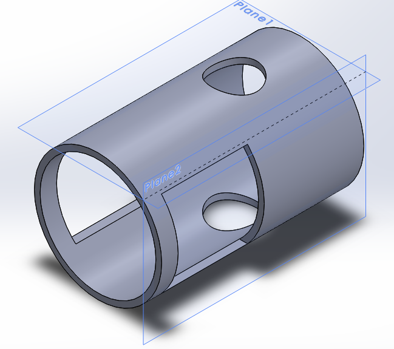
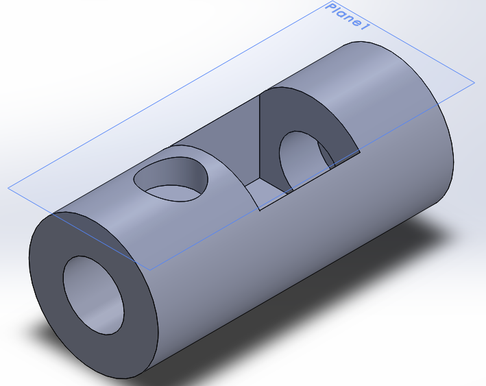
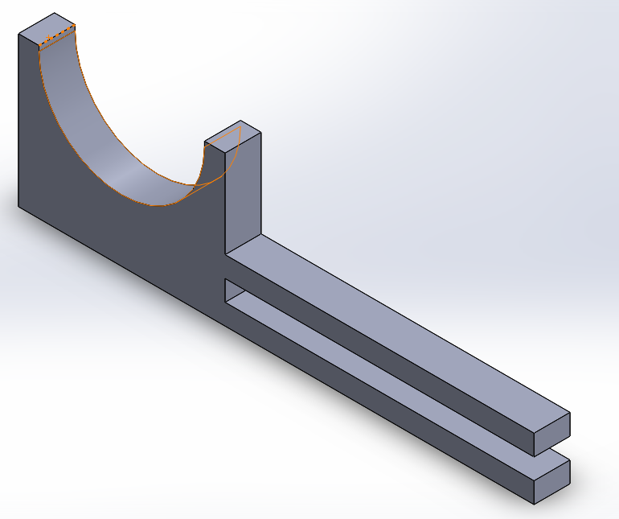
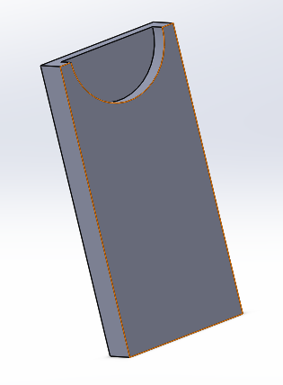

# Medical Dispenser: Casing and Collector

Stereolithography (STL) schematics of the physical casing and collector for the medical dispenser.

## 3-D Model Previews

You can view and manipulate the 3-D models on GitHub here:

* [Casing](stl/casing.STL)
* [Collector](stl/collector.STL)
* [Bottle slider](stl/bottle-slider.STL)
* [Stabilizer](stl/stabilizer.STL)

## Image Previews

### Casing

### Collector

### Bottle Slider

### Stabilizer

